<div align="center">
  
# ✨ Hiep Pham (hieppn) ✨


<p>
  
  
</p>

</div>

---

## 🚀 About Me

```typescript
const hiepPham = {
    name: "Hiep Pham",
    username: "hieppn",
    location: "Vietnam 🇻🇳",
    role: "Full Stack Developer",
    languages: ["Vietnamese", "English"],
    currentFocus: "Mobile & Web Development",
    hobbies: ["Coding", "Gaming", "Music", "Coffee ☕"],
    motto: "Code with passion, debug with patience! 💪"
};
```

<div align="center">

### � **"Passionate developer crafting digital experiences"** 💫

</div>

---

## �️ Tech Stack & Skills

<div align="center">

### **Languages**


### **Frontend Development**


### **Backend Development**


### **Databases**


### **Tools & DevOps**


</div>

---

## � GitHub Analytics

<div align="center">


</div>

<div align="center">


</div>

<div align="center">


</div>

---

## 🏆 GitHub Trophies

<div align="center">


</div>

---

## 🎯 Current Focus

```mermaid
graph LR
A[🚀 Learning] --> B[Cloud Technologies]
A --> C[DevOps Practices]
A --> D[Mobile Development]
A --> E[AI/ML Integration]

B --> F[AWS/Azure]
C --> G[CI/CD Pipelines]
D --> H[Flutter Advanced]
E --> I[TensorFlow]
```

<div align="center">



</div>

- 🔭 I'm currently working on **Flutter & .NET Applications**
- 🌱 I'm currently learning **Cloud Computing & DevOps**
- 👯 I'm looking to collaborate on **Open Source Projects**
- 🤔 I'm looking for help with **Machine Learning**
- 💬 Ask me about **Flutter, React, .NET, Node.js**
- ⚡ Fun fact: **I can debug faster with coffee! ☕**

---

## 📝 Latest Blog Posts

<div align="center">

<!-- BLOG-POST-LIST:START -->
📝 [My Personal Blog](https://HipSayu.github.io/blog_work/)
<!-- BLOG-POST-LIST:END -->

</div>

---

## 🎵 Spotify Playing

<div align="center">

[](https://open.spotify.com/user/hieppn)

</div>

---

## 🌐 Connect With Me

<div align="center">

[](mailto:sayu23102003@gmail.com)
[](https://linkedin.com/in/hieppn)
[](https://facebook.com/hieppn)
[](https://instagram.com/hieppn)
[](https://twitter.com/hieppn)
[](https://youtube.com/@hieppn)

</div>

---

<div align="center">

### 💖 Thanks for visiting my profile! 


**"Code is like humor. When you have to explain it, it's bad."** – Cory House

</div>

---

<div align="center">
  
**⭐ If you like my repositories, give them a star! ⭐**

Made with ❤️ and lots of ☕

</div>
